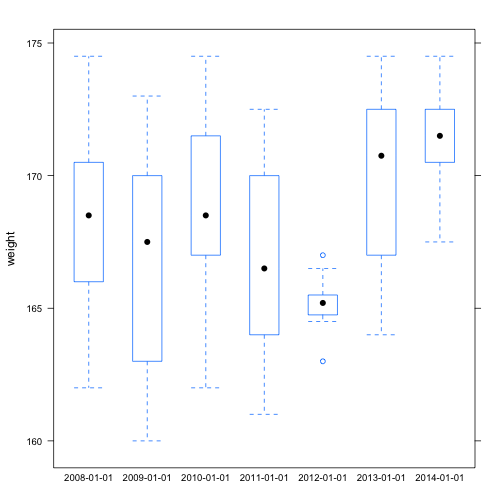
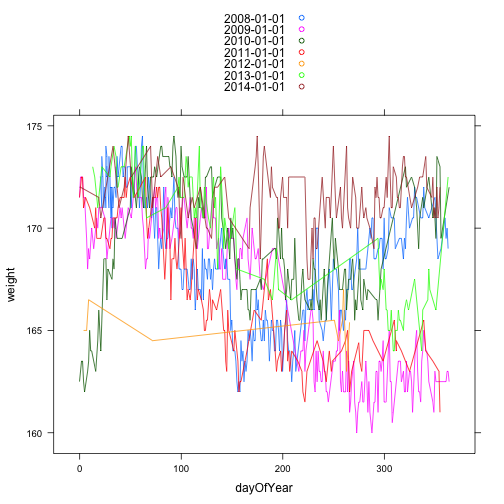
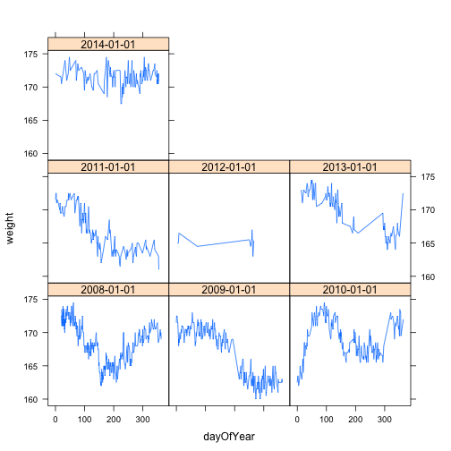

## Summary

This document demonstrates R markdown capabilities using my weight data gathered since 2008.

## Data

Data analyzed in this document was downloaded on 12/23/2014 from [Google Drive](https://docs.google.com/spreadsheet/pub?key=0Am9Zu_A32sZHdERNQWFxSUROTlV6SGd5WnkzMzRlb2c&output=html).
Data collection was performed sporadically, mostly using a [Google Docs form](https://docs.google.com/forms/d/1nx-yt3DvgvYYp6cmzDEz2yV_M3lECKBZwB8gUgKhUIc/viewform).
Data collection was almost always performed in the morning after waking up. 

The same scale was used for all measurements. Measurements were taken in pounds. The scale has a resolution of 0.5 pounds.

The purpose for data collection was typically to slow weight gain through increased visibility and awareness. For this reason, I would expect that weight values would start high as the need arose to record weights, then decrease (assuming increased awareness was sufficient to bring weight down), then recording would stop while the weight stayed at acceptable levels.

### Data Cleaning

The raw data has three variables:


```r
raw <- read.csv('Weight - Weight.csv', stringsAsFactors=FALSE)
str(raw)
```

```
## 'data.frame':	1145 obs. of  3 variables:
##  $ Timestamp: chr  "7/5/2011 11:08:26" "7/6/2011 9:21:32" "7/8/2011 13:31:31" "7/12/2011 6:23:39" ...
##  $ Date     : chr  "7/5/2011" "7/6/2011" "7/8/2011" "7/12/2011" ...
##  $ Weight   : chr  "168.5" "166.5" "167" "164.5" ...
```

The reason for the redundant date fields is historical. Originally, the data was entered through Google Docs, and the date was entered manually in the Date field. Data collection using a Google Docs form replaced manual entry, at which point the date was automatically entered in the Timestamp field.

The following R code creates a date field that uses the raw Timestamp field if it is available, and uses the raw Date field if raw Timestamp is not present. The new field also converts the dates in the native R date format. Note that times in the Timestamp column are ignored.


```r
CleanDate <- as.Date(raw$Timestamp, format = '%m/%d/%Y')

# The command above created missing (NA) values if Timestamp was missing. 
missing <- which(is.na(CleanDate))

# Fill in the missing dates from the Date field
CleanDate[missing] <- as.Date(raw$Date[missing], format = '%m/%d/%Y')

num_missing_dates <- sum(is.na(CleanDate))
```

Missing weights also need to be identified.


```r
CleanWeight <- as.numeric(raw$Weight)
```

```
## Warning: NAs introduced by coercion
```

```r
num_missing_weights <- sum(is.na(CleanWeight))
```

There were 1 missing dates and 10 missing weights. These were removed to create the clean dataset.


```r
# Create a new data frame with the cleaned dates (labeled Date)
data <- data.frame(date = CleanDate, weight = CleanWeight)

data <- data[! (is.na(CleanDate) | is.na(CleanWeight)),]
```

### Data Profile

The new data set has 1135 observations, collected between 2008-01-21 and 2014-12-22.


```r
s <- summary(data$weight)
s
```

```
##    Min. 1st Qu.  Median    Mean 3rd Qu.    Max. 
##   160.0   165.5   169.0   168.4   171.0   174.5
```

Half of the weights are in the range (165.5, 168.4). The boxplot below shows that most of the observations lie in the higher part of the range.


```r
boxplot(data$weight)
```

 

Given that more weight observations lie in the upper part of the range, we expect the distribution to be left skewed. The histogram below confirms the skew.


```r
hist(data$weight)
```

 


### Behavior over time

What we're really interested in is how weight changes over time. The plot below shows all of the cleaned observations over time.


```r
# Sort by date for the plot
data <- data[order(data$date),]

plot(data$date,data$weight,type="l")
```

 

THere's a troublesome trend. While early years show fluctuations over the full range of weights, 2014 weights seem to be stuck in the higher end of the range. To explore this trend further, we separate the years.

To compare the years, we use the lattice graphics package. Lattice is convenient for comparing multiple sets of data, as we want to do for different years.


```r
# Add a "year" field
data$year <- cut(data$date, 'year')

require(lattice)
```

```
## Loading required package: lattice
```

```r
bwplot(weight~year, data)
```

 

It's even worse than we feared. At least visually, there is an upward trend from 2012 to 2014. We can look at trends over the year to see whether 2014 patterns show a departure from previous years. Again, we use the lattice package.


```r
# Strip off the year
data$dayOfYear <- as.numeric(difftime(data$date, data$year, units="days"))

# Sort each of the years
data <- data[order(data$dayOfYear),]

xyplot(weight ~ dayOfYear
       , data
       , groups=year    # Use a different line for each year
       , type="l"
       , auto.key=TRUE) # create a legend
```

 

This is a little messy. Let's separate each of the years:


```r
xyplot(weight ~ dayOfYear | as.factor(year)
       , data
       , type="l")
```

 

